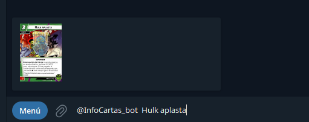
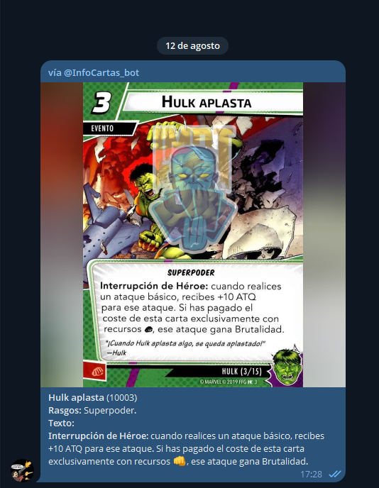

# InfoCartasBot

[](LICENSE)
[](https://www.python.org/)
[](https://github.com/python-telegram-bot/python-telegram-bot)

Bot de Telegram en modo **inline** que permite a jugadores de Marvel Champions LCG buscar cartas de [MarvelCDB](https://marvelcdb.com/) en español, directamente desde cualquier chat. No hace falta añadir el bot a un grupo — basta con escribir `@InfoCartas_bot <nombre de carta>` en cualquier conversación, grupo o privado, y elegir la carta del desplegable.

[](README.md)

## Demo

<p align="center">
  
  &nbsp;&nbsp;
  
</p>
<p align="center"><em>Búsqueda inline → resultado de la carta, con marca de agua, enviada directamente al chat.</em></p>

## Índice

- [Qué hace](#qué-hace)
- [Comandos](#comandos)
- [Arquitectura](#arquitectura)
- [Estructura del proyecto](#estructura-del-proyecto)
- [Puesta en marcha](#puesta-en-marcha)
- [Ejecución](#ejecución)
- [Stack técnico](#stack-técnico)
- [Detalles destacados](#detalles-destacados)
- [Licencia](#licencia)

## Qué hace

- **Búsqueda inline** con coincidencia difusa e insensible a mayúsculas/acentos (`rapidfuzz`) — tolera errores tipográficos y coincide por nombre completo, parcial o nombre secundario de la carta.
- **Búsqueda con filtros** vía `/buscar` por tipo, aspecto, rasgo, pack, set y estadísticas (coste, INT, ATQ, DEF, Vida).
- **Imágenes de carta con marca de agua**, subidas una vez a Telegram y cacheadas por `file_id` — las búsquedas repetidas reutilizan la subida en caché en vez de volver a enviar la imagen.
- **Actualización de datos en caliente**: el comando `/actualizar` (solo administradores) descarga datos frescos de cartas/traducciones desde dos repositorios externos y los recarga en el proceso en ejecución, sin reiniciar. Ver [Arquitectura](#arquitectura) para el detalle de ese pipeline.

## Comandos

| Comando | Quién | Descripción |
|---|---|---|
| `@InfoCartas_bot <nombre o código>` | Cualquiera | Consulta inline — desplegable en vivo con las cartas que coinciden mientras escribes, desde cualquier chat |
| `/buscar filtro=valor, ...` | Cualquiera | Búsqueda con filtros, ej: `/buscar set=SP//dr, tipo=evento, coste=2` |
| `/ayuda` | Cualquiera | Muestra la lista de comandos |
| `/mi_id` | Cualquiera | Muestra tu ID de Telegram (útil para añadirte como admin) |
| `/actualizar` | Admin | Descarga datos frescos de los repos externos y los recarga en caliente, sin reiniciar |
| `/check_update` | Admin | Comprueba si hay cambios remotos pendientes, sin aplicarlos |
| `/estado_update` | Admin | Indica si hay una actualización en caliente en curso |

Los administradores se configuran vía la variable de entorno `BOT_ADMIN_IDS` y/o `bot/admin_ids.txt` (ver [`.env.example`](.env.example)).

## Arquitectura

InfoCartasBot no genera ni traduce sus propios datos de cartas — los construye a partir de dos repositorios externos mantenidos de forma independiente (el dataset canónico en inglés de MarvelCDB y un proyecto comunitario de traducción al español) mediante un pipeline offline, y sirve el resultado por Telegram con caché en memoria.

El detalle completo — diagrama del flujo de datos, por qué hacen falta los repos externos, el mecanismo de actualización en caliente y la estrategia de caché de imágenes — está en **[ARCHITECTURE.md](ARCHITECTURE.md)** (en inglés).

## Estructura del proyecto

```
bot/                    Bot de Telegram en ejecución
├── main.py             Punto de entrada: handlers, índice de búsqueda difusa, recarga en caliente
├── data/                Datos en tiempo de ejecución (JSON de cartas) + herramientas de imagen
│   ├── marvelcdb_spanish.json   Dataset de cartas ya generado (ver Arquitectura)
│   ├── marca_agua_v2.py         Aplica marca de agua a las imágenes de carta
│   └── telegram_imagenes.py     Sube imágenes a Telegram y cachea sus file_id
└── live_update/
    └── soft_updater.py Actualización en caliente: git pull + regenerar + recargar, sin reiniciar

pipeline/                Pipeline offline de preparación de datos (genera bot/data/marvelcdb_spanish.json
                         a partir de los dos repos externos, ver ARCHITECTURE.md)

docs/                    Documentación adicional
```

## Puesta en marcha

```bash
pip install -r requirements.txt
cp .env.example .env   # rellena TELEGRAM_BOT_TOKEN y BOT_ADMIN_IDS
```

`bot/data/` ya incluye un dataset de cartas generado, así que el bot funciona de forma independiente sin necesitar los repos externos — esos solo son necesarios para *regenerar* el dataset (ver [ARCHITECTURE.md](ARCHITECTURE.md)).

## Ejecución

```bash
cd bot
python main.py
```

## Stack técnico

- **Python** + [`python-telegram-bot`](https://github.com/python-telegram-bot/python-telegram-bot) (asíncrono, basado en `Application`/handlers)
- [`rapidfuzz`](https://github.com/rapidfuzz/RapidFuzz) — coincidencia difusa de nombres
- [`cachetools`](https://github.com/tkem/cachetools) — caché en memoria con TTL
- [`Pillow`](https://python-pillow.org/) — marca de agua en imágenes
- `python-dotenv` — carga de variables de entorno en local

## Detalles destacados

Algunas decisiones de implementación que surgieron al construir esto:

- **Índice de búsqueda difusa normalizado**: los nombres de carta se normalizan (minúsculas, sin acentos) al cargar los datos y se reindexan en cada recarga en caliente, así la búsqueda se mantiene rápida y tolerante a errores sin normalizar en cada consulta.
- **Caché de `file_id` para respetar los límites de subida de Telegram**: cada imagen con marca de agua se sube una sola vez y su `file_id` de Telegram se cachea; cada resultado inline posterior reutiliza ese ID en vez de volver a subir la imagen, evitando los límites de flood de Telegram a gran escala (miles de cartas).
- **Recarga en caliente sin downtime**: `/actualizar` vuelve a descargar los datos y los intercambia en memoria bajo un lock, así el bot nunca necesita reiniciarse (ni puede dispararse dos veces a la vez) para incorporar packs nuevos o correcciones de traducción.
- **Pipeline de datos separado del bot**: el bot nunca habla directamente con los repos externos — un paso dedicado en `pipeline/` se encarga de fusionar/traducir/reformatear, así el proceso en ejecución solo trata con un único JSON ya generado.

## Licencia

MIT — ver [LICENSE](LICENSE).

---

Hecho por [@Emigarsan](https://github.com/Emigarsan).
